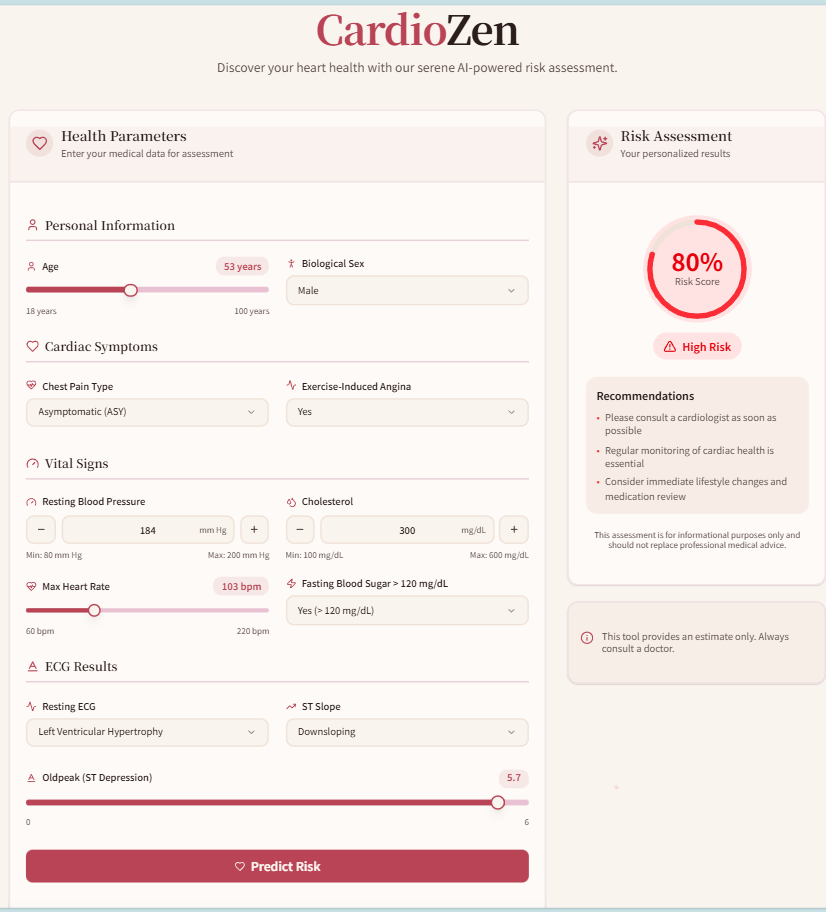

Human Stroke Prediction

A web-based Human Stroke Prediction system that predicts the risk percentage of a stroke based on user-provided health parameters. The project combines machine learning with an interactive frontend for a seamless user experience.

🧠 Project Overview

Stroke is a leading cause of death worldwide. Early prediction can help in timely prevention. This project uses K-Nearest Neighbors (KNN), which provided the most accurate predictions among other algorithms tested.

The model predicts the risk percentage of a stroke based on parameters like age, sex, blood pressure, cholesterol levels, chest pain type, and more.

⚙️ Features

Predicts stroke risk percentage based on user inputs

Built with a KNN machine learning model

Backend connected to a user-friendly frontend built with Next.js and JSON data

Exposes a REST API for prediction

Clean and interactive UI for an amazing user experience

Fully functional end-to-end system: Input → Prediction → Result

📌 How It Works

Data Input: User provides health-related details via the frontend.

Backend Processing: API receives data and passes it to the trained KNN model.

Prediction: Model calculates the stroke risk percentage.

Result Display: Frontend shows the result in an interactive, clean UI.

📷 Screenshot

Here’s how the UI looks:

